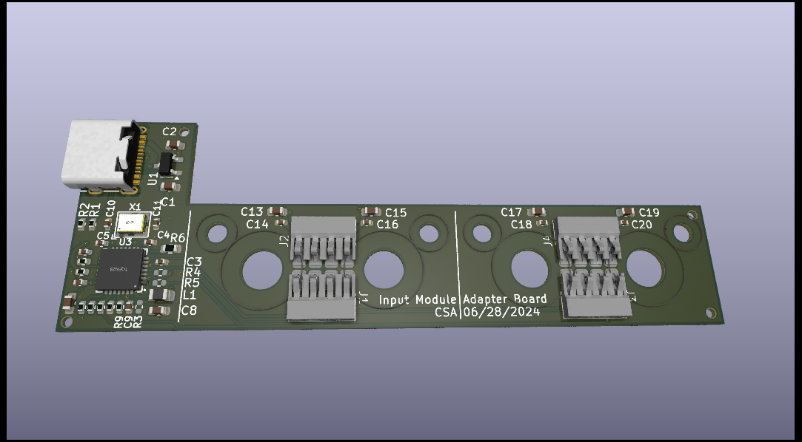

# Input Module Adapter

This is a USB-C adapter to mount and use two small Input Modules or
one medium Input Module (like a numeric keypad) outside
of a Framework Laptop 16.  Note that the actual pogo pin connector is a 
custom Framework part which they have not made generally available;
I am using a pair of alternate connectors from Molex which are compatible.

The PCB incorporates a 4-port USB 2.0 hub, so that both input module
slots can be active.  If you only need the leftmost input module connector
to be functional (because you only want to use a medium-size Input Module,
for example), then you can omit many of the components and populate R3/R4/R5
as indicated on the [schematic](./SpringAdapter.pdf).

Further discussion can be found on the Framework Community forums at
https://community.frame.work/t/external-usb-c-enclosure-for-input-modules/53695

## License
Input Modules © 2023 by Framework Computer Inc is licensed under CC BY 4.0.

This external enclosure is © 2024 by
C. Scott Ananian and is also licensed under CC BY 4.0.

To view a copy of this license,
visit http://creativecommons.org/licenses/by/4.0/

## Assembly and Fabrication

**THIS DESIGN HAS NOT YET BEEN TESTED. CAVEAT LECTOR.**

This has been designed for PCBA by JLCPCB, and appropriate LCSC parts
numbers are included in the kicad files.  Hand soldering the molex
input module connectors may be required, as JLC does not tend to keep
these in stock -- although you can special order them, you might
find it easier to [obtain them from DigiKey](https://www.digikey.com/en/products/detail/molex/0472861001/4553726)
and hand-solder them (or use a hot plate).

Use a 0.8mm PCB.  The needed files for JLCPCB fabrication are in
the [production](./production) directory.  Use `bom.csv` and `positions.csv`
for PCBA.

The enclosure and lid have been designed in FreeCad.  Some of the tolerances
and thicknesses might be challenging to print on a home 3d printer; I had
JLCPCB print these using SLS in black nylon; the STEP files are provided
in [External Enclosure.step](./External%20Enclosure.step) and
[Lid.step](./Lid.step).

To make Input Modules attach to the
adapter, you can glue in 5mm x 2mm cylindrical magnets or glue on
5mm x 5mm x 1.2mm square magnets.

There are recesses on the bottom surface for <=8mm rubber bumper feet,
like [these from DigiKey](https://www.digikey.com/en/products/detail/3m/SJ5076/570288) (but you can get these anywhere).

Use M2x6mm flathead fasteners as the alignment pins, with a M2 nut on the top
of the PCB (which also serves to secure the PCB in the case).  You can
probably get away with using pan head fasteners if the rubber bumpers are
tall enough.

There are cutouts for 3mm x 1.5mm cylindrical magnets on the front face
and on the lid to secure the lid.  Ensure the polarities are appropriate
such that the lid is attracted to the body of the enclosure!

